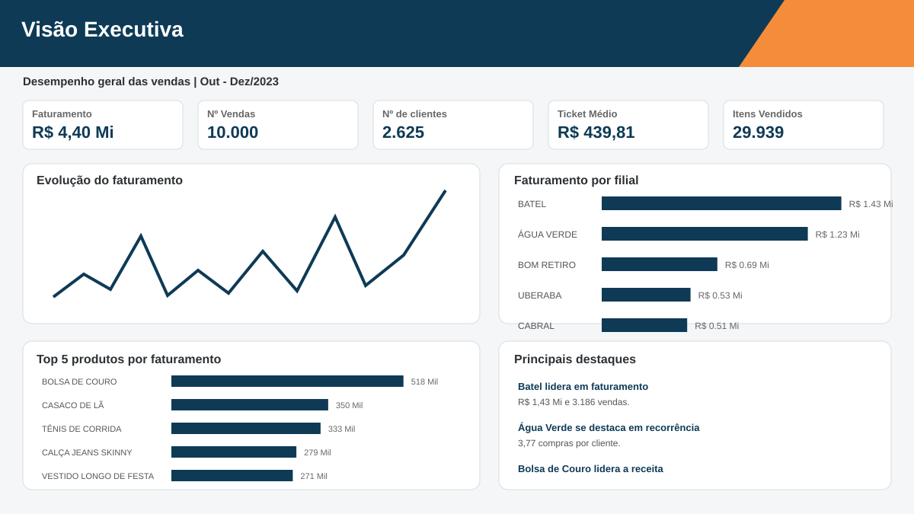

# Inteligência de Mercado no Varejo | Power BI

Projeto de portfólio desenvolvido a partir de um case fictício de inteligência de mercado no varejo de moda.

O objetivo foi transformar dados transacionais em informações úteis para decisões de **vendas, distribuição de produtos, segmentação de clientes e marketing**.

## Objetivo

A análise foi estruturada para responder três perguntas principais:

1. Quais padrões de vendas e diferenças de desempenho aparecem entre as filiais?
2. Quais perfis de consumidores podem ser identificados a partir do comportamento de compra?
3. Como transformar esses achados em recomendações práticas de portfólio, relacionamento e promoções?

## Ferramentas

- Power BI
- Power Query
- DAX
- Modelagem de dados
- Análise exploratória
- Storytelling com dados

## Estrutura do dashboard

### 1. Visão Executiva

Visão consolidada do período, com indicadores de faturamento, vendas, clientes, ticket médio, itens vendidos, evolução do faturamento, desempenho das filiais e principais produtos.



### 2. Filiais & Mercado

Comparação das filiais considerando faturamento, base de clientes, ticket médio, recorrência, itens por venda e faturamento por cliente. Também foi analisada a origem geográfica dos consumidores.


### 3. Consumidores & Preferências

Segmentação comportamental baseada em **frequência de compra × valor acumulado por cliente**.

A distribuição foi analisada por quartis e a mediana foi utilizada como ponto de corte para quatro perfis:

- **Alto Valor**
- **Ocasional**
- **Recorrente**
- **Alto Ticket**


### 4. Estratégia & Oportunidades

Síntese dos principais achados e recomendações práticas para portfólio, relacionamento e promoções.


## Principais resultados

No período analisado, a base apresentou:

| Indicador | Resultado |
|---|---:|
| Faturamento | R$ 4,40 milhões |
| Vendas | 10.000 |
| Clientes | 2.625 |
| Ticket médio | R$ 439,81 |
| Itens vendidos | 29.939 |

Entre as filiais, **Batel** liderou o faturamento, com aproximadamente **R$ 1,43 milhão**, enquanto **Água Verde** apresentou a maior recorrência, com **3,77 compras por cliente**. **Cabral** apresentou o maior ticket médio, próximo de **R$ 455**.

A base de consumidores também apresentou forte concentração geográfica: **2.027 clientes estão em Curitiba**, aproximadamente **77,2% da base**.

## Segmentação de clientes

| Perfil | Clientes | % da base | Faturamento | Ticket médio | Compras/cliente |
|---|---:|---:|---:|---:|---:|
| Alto Valor | 1.057 | 40,3% | R$ 3.319.554,30 | R$ 468,86 | 6,70 |
| Ocasional | 996 | 37,9% | R$ 438.735,70 | R$ 313,38 | 1,41 |
| Alto Ticket | 256 | 9,8% | R$ 407.718,35 | R$ 890,21 | 1,79 |
| Recorrente | 316 | 12,0% | R$ 232.070,95 | R$ 218,52 | 3,36 |

O principal destaque foi o segmento **Alto Valor**: ele representa **40,3% da base**, mas concentra aproximadamente **75,5% do faturamento**.

Já os clientes **Ocasionais** representam **37,9% da base**, porém realizam apenas **1,41 compra por cliente**, indicando uma oportunidade relevante para estratégias de segunda compra e desenvolvimento de recorrência.

## Preferências de produto

O ranking de produtos muda conforme o perfil selecionado.

No segmento **Recorrente**, por exemplo, os produtos de maior faturamento foram:

1. Calça Jeans Skinny
2. Sandálias de Tiras
3. Suéter de Tricô
4. Camiseta Básica de Algodão
5. Shorts de Sarja

Essa leitura permite trabalhar portfólio, exposição e ações de cross-sell de forma mais direcionada.

## Recomendações

- **Alto Valor:** retenção e proteção da frequência de compra.
- **Ocasional:** estimular a segunda compra com ações pós-compra e incentivos direcionados.
- **Recorrente:** aumentar a cesta média por meio de cross-sell, kits e produtos complementares.
- **Alto Ticket:** estimular recompra com novidades e produtos de maior valor.
- **Portfólio:** usar preferência por perfil e desempenho da filial para orientar estoque e exposição.
- **Promoções:** evitar desconto generalizado e testar incentivos segmentados.

## Promoções e limitações

O desconto foi estimado pela diferença entre o preço de tabela e o preço efetivamente praticado.

Os descontos médios ficaram próximos entre os segmentos, em torno de **2,3% a 2,4%**. Como a base não identifica campanhas específicas, exposição à comunicação ou grupos de controle, a análise não permite atribuir causalidade promocional.

Por isso, as recomendações de promoção foram tratadas como **hipóteses a serem testadas e acompanhadas por indicadores de resposta**.

## Estrutura do repositório

```text
retail-market-intelligence/
├── README.md
├── images/
│   ├── visao-executiva.svg
│   ├── filiais-mercado.svg
│   ├── consumidores-preferencias.svg
│   └── estrategia-oportunidades.svg
├── docs/
│   ├── apresentacao.md
│   └── documentacao-tecnica.md
├── dax/
│   └── medidas.md
└── .gitignore
```

## Observação

Os dados utilizados neste projeto são fictícios e foram analisados exclusivamente para fins de estudo e portfólio. A base original do desafio e o arquivo PBIX não são disponibilizados neste repositório.

---

**Maria Gabriela Marcos**  
Inteligência de Mercado | Business Intelligence | Power BI
